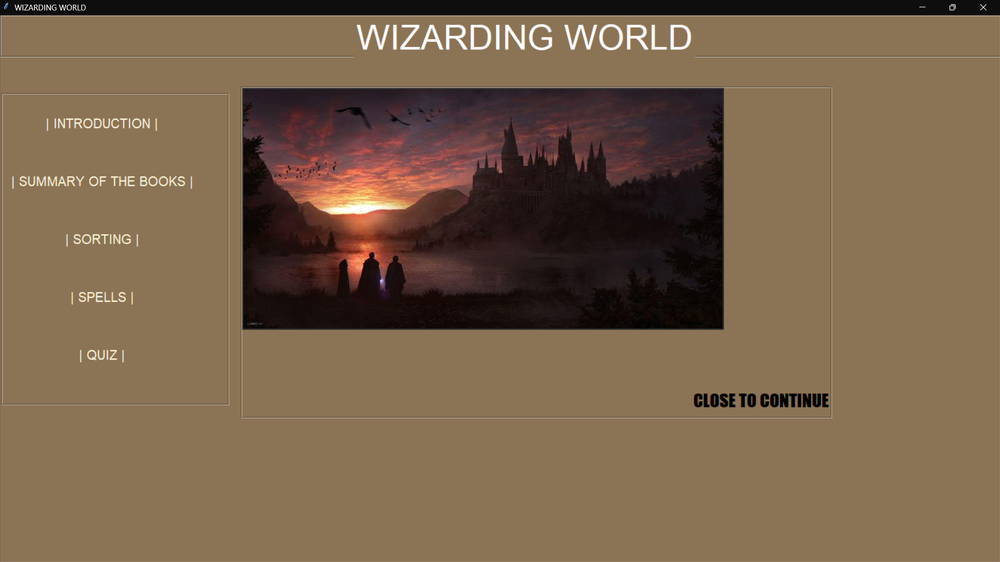
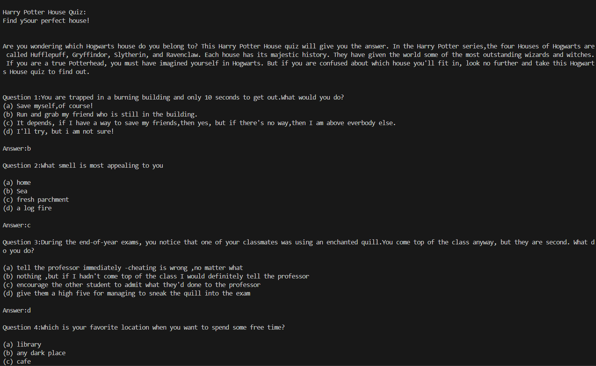
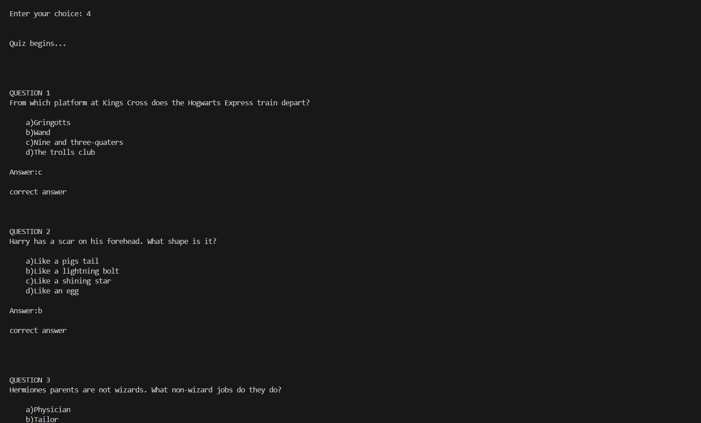
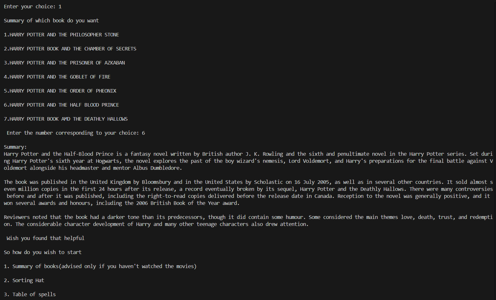

# WizardingWorld

Welcome to the "WizardingWorld!" This project is a Python-powered web application dedicated to exploring the magical world of Harry Potter. It includes an interactive collection of spells, quizzes to test your knowledge, and summaries of each book in the series.

## Table of Contents
- [Features](#features)
- [Installation](#installation)
- [Database Structure](#database-structure)
- [Usage](#usage)
- [Technologies Used](#technologies-used)
- [Screenshots](#screenshots)
- [Future Enhancements](#future-enhancements)
- [License](#license)

## Features

- **Book Summaries**: Summaries of each book in the Harry Potter series, giving users a quick recap of the story and key events.
- **Spells Database**: A SQL-based table containing a variety of spells, their effects, and usage descriptions.
- **Quizzes**: Multiple-choice quizzes to test your Harry Potter knowledge.

## Installation

To run this project locally, follow these steps:

1. Clone this repository:
    ```bash
    git clone https://github.com/MariamSkaria/WizardingWorld.git
    ```

2. Navigate to the project directory:
    ```bash
    cd WizardingWorld
    ```

3. Set up a virtual environment (optional but recommended):
    ```bash
    python3 -m venv venv
    source venv/bin/activate  # On Windows, use `venv\Scripts\activate`
    ```

4. Install the required packages:
    ```bash
    pip install -r requirements.txt
    ```

5. Set up the database:
    - Run the SQL file (e.g., `spells.sql`) to create the table of spells in your SQL database.
    - Adjust your database connection settings in the configuration file.

6. Run the application:
    ```bash
    python app.py
    ```
## Database Structure

### Spells Table
The `spells` table includes the following fields:

| Column         | Type         | Description                      |
|----------------|--------------|----------------------------------|
| `id`           | INTEGER      | Unique ID for each spell        |
| `name`         | VARCHAR      | Name of the spell                |
| `effect`       | TEXT         | Description of the spell's effect|
| `usage`        | TEXT         | Common uses or origins          |

### Quizzes
- Each quiz has multiple-choice questions about the Harry Potter series.
- Users can answer questions and get immediate feedback.

### Book Summaries
- Each book in the Harry Potter series has a summary page.
- Pages include key events, character introductions, and notable quotes.

## Usage

- **View Spells**: Navigate to the "Spells" section to explore various spells from the Harry Potter universe.
- **Take a Quiz**: Visit the "Quiz" section and test your knowledge of Harry Potter with interactive questions.
- **Read Book Summaries**: Check out the "Books" section for a summary of each Harry Potter book, including major events and characters.

## Technologies Used

- **Python**: Backend logic
- **SQL**: Database for storing spell information

## Screenshots






## Future Enhancements

- **Character Profiles**: Add detailed profiles of main characters with background, house information, and traits.
- **Spell Search**: Implement a search feature for users to easily find spells.
- **Interactive Quizzes**: Include more questions and a score-tracking system.

## License

This project is licensed under the MIT License. See the [LICENSE](LICENSE) file for more details.

---

Enjoy exploring the magical world of Harry Potter!
